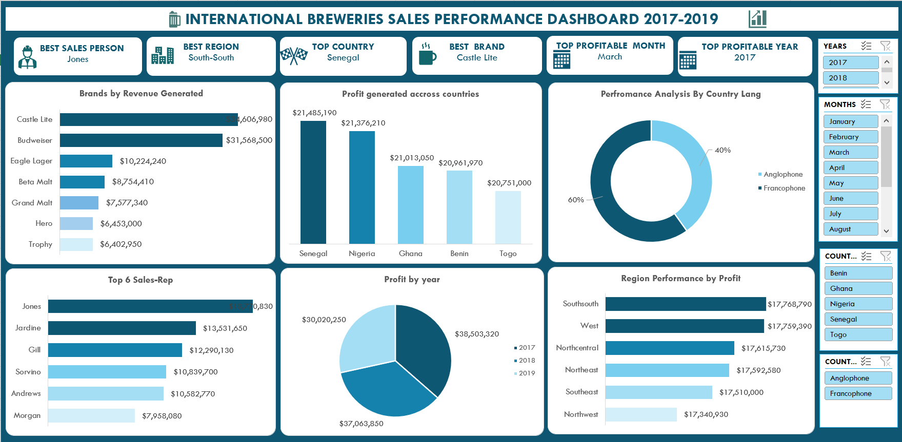
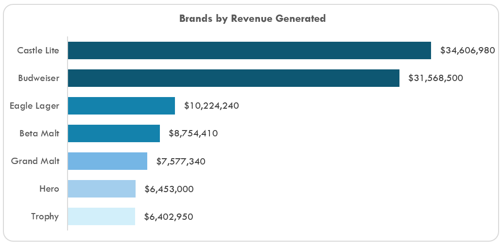
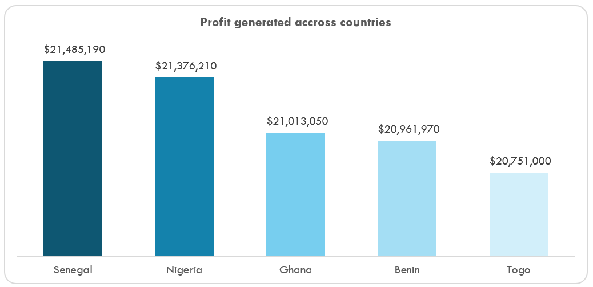
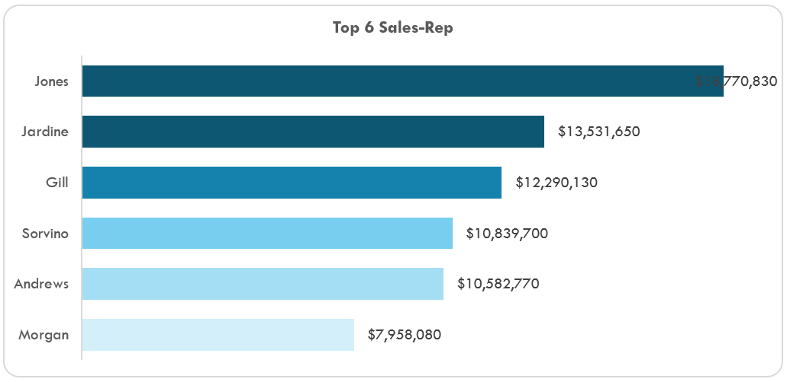
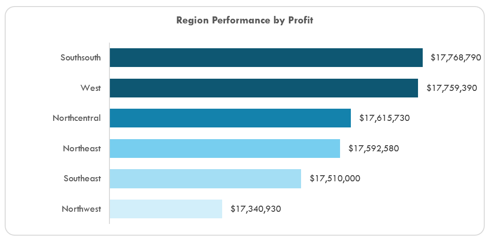

# International-Breweries-Sales-Performance-Dashboard

## 1. Introduction
This report outlines the development, analysis, and insights derived from the International Breweries Sales Performance Dashboard, which evaluates the company's regional and global sales activities over the period of 2017 to 2019. It is designed for decision-makers seeking to optimize marketing strategies, improve sales outcomes, and expand into profitable markets.

## 2. Overview
The dashboard aggregates sales and profit data across multiple dimensions—brands, sales representatives, regions, countries, and years—to offer a comprehensive view of performance. It highlights key metrics such as top-performing sales reps, most profitable regions and brands, and revenue distribution across countries.

## 3. Problem Statement
International Breweries needed a data-driven approach to:
-	Identify top-performing brands, products, regions, and representatives.
-	Understand country-level sales contributions and language group performance.
-	Monitor revenue and profit trends over time.
-	Provide actionable insights to optimize resource allocation and strategy.

## 4. Skills Demonstrated
-	Data wrangling and transformation in Excel
-	Pivot table construction
-	Dashboard design using charts and slicers
-	Data visualization and storytelling
-	Analytical reasoning and business intelligence reporting

## 5. Data Source
The dataset was extracted from Kaggle. These included transactional records of:
-	Sales revenue by brand
-	Profits by region and country
-	Performance of individual sales representatives
-	Profit distribution by year and month

## 6. Data Cleaning and Transformation
-	Removed duplicates and null values.
-	Standardized naming conventions across datasets (e.g., regions and brand names).
-	Created calculated fields for revenue and profit margins.
-	Transformed categorical fields for country language grouping (Anglophone vs. Francophone).
-	Aggregated and grouped values for dashboard summarization.

## 7. Exploratory Data Analysis (EDA)
EDA was conducted using pivot tables and slicers. Key exploration dimensions included:
-	Performance comparisons across countries, brands, and sales reps
-	Profit contribution by region and language category
-	Brand revenue 
## 8. Insights from Dashboard Charts
### Brands by Revenue Generated

-	Castle Lite and Budweiser were the top revenue generators, earning $34.6M and $31.6M respectively.
-	Lower-performing brands included Hero and Trophy, each contributing around $6.4M.
### Profit Generated Across Countries

-	Senegal led in profitability at $21.49M, closely followed by Nigeria at $21.38M.
-	Togo had the lowest contribution among the top five countries.
### Top 6 Sales Representatives

-	Jones was the highest-performing sales rep, generating $18.7M, with a significant lead over others.
-	Other top contributors include Jardine, Gill, and Sorvino.
Profit by Year
-	2017 was the most profitable year ($38.5M), followed by 2019 and 2018.
-	Indicates potential strategic success in 2017 marketing and sales campaigns.
### Performance Analysis by Country Language

-	Anglophone countries accounted for 60% of overall performance.
-	Francophone countries contributed 40%, suggesting opportunities for market expansion.
### Region Performance by Profit

-	South-South and West regions had the highest profit contributions (~$17.7M each).
-	Northwest was the lowest-performing region at $17.3M.

### 9. Recommendations
-	Expand marketing efforts for Castle Lite and Budweiser, focusing on markets where they already perform well.
-	Replicate strategies from 2017 that contributed to the high profit margin across other years.
-	Invest in top-performing regions (e.g., South-South and West) and countries (Senegal and Nigeria) to consolidate market presence.
-	Enhance training for mid-level reps to elevate performance to that of top reps like Jones.
-	Explore Francophone market opportunities further, particularly in underperforming countries like Togo.
-	Improve underperforming brands or consider repositioning/discontinuation based on detailed cost-benefit analysis.

### 10. Conclusion
The International Breweries Sales Performance Dashboard provides a holistic view of the company’s sales dynamics from 2017 to 2019. Leveraging data visualization, it reveals key strengths, underperforming areas, and untapped opportunities across brands, regions, and representatives. With targeted actions based on these insights, the company can drive stronger profitability and sustained growth.

